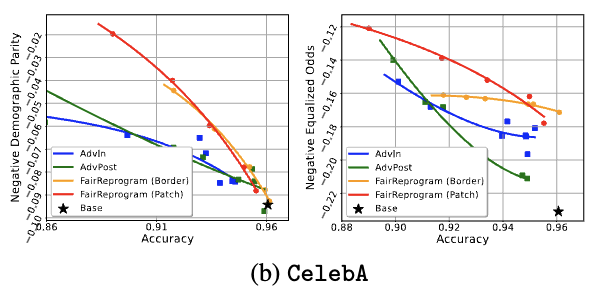

## What is in this folder?
This repository contains the codes and commands to perform fairness reprogramming on the computer vision classification task. In particular, this repository provides three methods to train the model on the [CelebA dataset](https://mmlab.ie.cuhk.edu.hk/projects/CelebA.html), namely standard training, fairness-adversarial training, and fairness reprogramming. We will introduce these methods with more details below. 

## Getting Started

### CelebA Dataset

If you find dealing with CelebA dataset is tedious and exhausting, congratulations! You just found the right repo to start with CelebA.

#### Dataset Preparation

To ease the pain of the beginners with CelebA dataset, we re-organized the CelebA dataset into one single file with [h5py](https://www.h5py.org/) and encapsulated the data loaders in the standard PyTorch format `torch.utils.data.DataLoader`. At the same time, we also provide the dataloader that applies to the original CelebA dataset. Please see `dataset.py`.

To acquire the dataset file, you need to first download the `celeba.hdf5` file from [here](https://drive.google.com/drive/folders/1lbw4laF9vsNKVAzTZoCjla-dGNAAFVtz?usp=sharing) and provide the path to this file to the `--data-dir` parameter (see below). You are all set!

If you choose to use the original dataset (in case you suspect we did something bad to the dataset in the file we provided, which we, of course, did not commit at all), you should also incorporate all the kaggle csv files which can be obtained [here](https://drive.google.com/drive/folders/1lbw4laF9vsNKVAzTZoCjla-dGNAAFVtz?usp=sharing) and link the data folder to the `--data-dir` folder.

#### Attributes

As you may be aware that each image in CelebA are annotated with 39 attributes, you should carefully choose the 'target attributes' and the 'sensitive attribute' before you start training your model. 

* 'target attribute': The target attribute determines the function of your model --- what classification task do you want your model to accomplish. The target attributes can be a single attribute, in which case it becomes a binary classification task, or multiple attributes, where `n` different attributes will form 2^n classes. In our paper, we considered `Blond Hair`, `Smiling`, `Attractive`, and `Wavy_Hair` as target attributes.

* 'sensitive attribute': this is the bias-related attribute, of which you want the decision of your model to be independent. We stick to the attribute `Male` (gender) as the sensitive attribute through the experiments.

However, whichever attribute you choose, please make sure they are identical to the ones provided in the `attr_list`, which you can find at the beginning of `train.py`.

### Key Parameters

The training primarily uses the file `train.py`. In this section, we will explain the model parameters with details.

* `--data-dir` the path to your dataset. You should provide the path either to the `hdf5` file or to the folder containing the original CelebA dataset with the `.csv` files (see more instructions in #celeba-dataset).
* `--result-dir` the directory you want to store your results.
* `--checkpoint` use this parameter to provide the path to the pretrained model when you use reprogramming method.
* `--target-attrs` use this parameter to specify the target attributes (use `,` to split multiple inputs)
* `--domain-attrs` use this parameter to specify the sensitive (bias-related) attribute.
* `--exp-name` use this parameter to specify the identifier of this experiment trial.
* `--arch` use this parameter to specify the model architecture you want to use. You can also add your own model architectures.
* `--method` use this method to specify the training method. `std | adv | repro | rpatch` represents the standard training, adversarial training, reprogramming with border trigger, reprogramming with patch trigger.

* `--adversary-with-y` use this parameter to specify the fairness metric, true for Equalized Odds and false for demographic parity.

* `--adversary-lr` use this parameter to specify the adversary learning rate. This parameter applies to both adversarial training and reprogramming.
* `--lmbda` use this parameter to specify the coefficient of the fairness regularization. In general, a large lambda results in a more fair model but worse accuracy.

* `--reprogram-size` use this parameter to specify the size of the reprogrammer. Note for border trigger, this denotes the size of the width of the border frame, and for patch trigger, it represents the length of the square trigger.
* `--trigger-data-num` use this parameter to specify the data you want to use to train your model.

### Training Methods



We will provide specific commands to enable training with different methods to reproduce the results.

#### Standard Training

The standard training method trains the model with empirical risk minimization (ERM). 

```
python3 train.py --data-dir PATH_TO_DATA --target-attrs Blond_Hair --domain-attrs Male --method std --arch resnet18 --result-dir std -seed 1234
```

```
python3 train.py --data-dir PATH_TO_DATA --target-attrs Blond_Hair --domain-attrs Male --method std --arch resnet18 --result-dir std -seed 2022 --adversary-with-y
```


#### Adversarial Training

The adversarial training co-trains the model and an adversary network, which tries to predict the domain attribute based on the output of the model. The idea is borrowed from GAN. 

```
python3 train.py --data-dir PATH_TO_DATA --result-dir adv --epochs 20 --target-attrs Blond_Hair --adversary-with-logits --lmbda 0.05 --m adv --seed 2022
```

```
python3 train.py --data-dir PATH_TO_DATA --result-dir adv --epochs 20 --target-attrs Blond_Hair --adversary-with-logits --lmbda 0.05 --m adv --adversary-with-y --seed 2022
```

#### Reprogramming with Patch Trigger

We can enable training with patch trigger using the following command.

```
python3 train.py --data-dir PATH_TO_DATA --result-dir patch --reprogram-size 30 --epochs 20 --target-attrs Blond_Hair --adversary-with-logits --lmbda 0.05 --m rpatch --adversary-with-y --checkpoint PATH_TO_PRETRINED_MODEL --seed 2022
```

```
python3 train.py --data-dir PATH_TO_DATA --result-dir patch --reprogram-size 30 --epochs 20 --target-attrs Blond_Hair --adversary-with-logits --lmbda 0.05 --m rpatch --adversary-with-y --checkpoint PATH_TO_PRETRINED_MODEL --adversary-with-y --seed 2022
```

#### Reprogramming with Border Trigger

We can enable training with border trigger using the following command.

```
python3 train.py --data-dir PATH_TO_DATA --result-dir border --reprogram-size 20 --epochs 20 --target-attrs Blond_Hair --adversary-with-logits --lmbda 0.05 --m repro --adversary-with-y --checkpoint PATH_TO_PRETRINED_MODEL --seed 2022
```

```
python3 train.py --data-dir PATH_TO_DATA --result-dir border --reprogram-size 20 --epochs 20 --target-attrs Blond_Hair --adversary-with-logits --lmbda 0.05 --m repro --adversary-with-y --checkpoint PATH_TO_PRETRINED_MODEL --adversary-with-y --seed 2022
```
## Citation

If you find this repository useful, please consider to cite our work:

```
@inproceedings{zhang2022fairness,
  title = {Fairness Reprogramming},
  author = {Zhang, Guanhua and Zhang, Yihua and Zhang, Yang and Fan, Wenqi and Li, Qing and Liu, Sijia and Chang, Shiyu},
  booktitle = {Thirty-sixth Conference on Neural Information Processing Systems},
  year = {2022}
}
```
