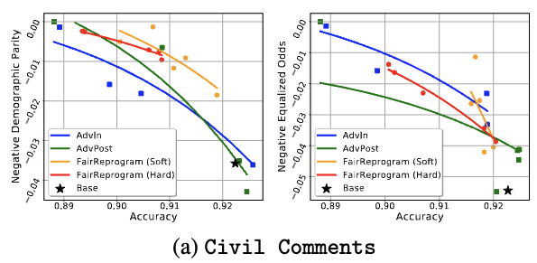

## What is in this folder?
This repository contains the codes and commands to perform fairness reprogramming on the NLP classification task. In particular, this repository provides five methods to train the model on the [Civil Comments](https://wilds.stanford.edu/get_started/#downloading-and-training-on-the-wilds-datasets) dataset, namely standard training, fairness-adversarial training, and fairness reprogramming. 

## Getting Started
Clone the repository with the following commands.
```
git clone https://github.com/UCSB-NLP-Chang/Fairness-Reprogramming.git
cd Fairness-Reprogramming/CivilComments
```
Then build the environment with the following command.
```
conda create -y -n fairness_reprogram python scikit-learn pandas matplotlib tqdm nltk ipython gitpython pytorch=1.10.0 torchvision torchaudio torchtext transformers cudatoolkit=11.3 -c pytorch
conda activate fairness_reprogram
pip install captum
```

### Dataset Preparation
The Civil Comments dataset could be downloaded with the codes provided in [WILDS](https://wilds.stanford.edu/get_started/#downloading-and-training-on-the-wilds-datasets). Run the following codes in the root directory of this folder to download the dataset.
```
mkdir .data
git clone git@github.com:p-lambda/wilds.git
cd wilds
pip install -e .
python wilds/download_datasets.py --root_dir data --datasets civilcomments
mv data/civilcomments_v1.0 ../.data/civil_comments
cd ..
```
The resulting directory *.data* will be placed in the root directory of this folder and look like the follows,
```
├─.data
│  -civil_comments
|       all_data_with_identities.csv
```

### Reproduce the Results


Don't worry about the complicated command parameters! We provide all commands to train and evaluate with different methods including standard training (*ERM*), fairness adversaril training (*AdvIn* and *AdvPost*) and fairness reprogramming (*FairReprogram(Soft)* and *FairReprogram(Hard)*). All commands are presented in [scripts/dp_exec.sh](scripts/dp_exec.sh) and [scripts/eo_exec.sh](scripts/eo_exec.sh) for experiments with *Demographic Parity* metric and *Equalized Odds* metric, respectively. **You could use the two scripts to reproduce the corresponding experiments as follows.**
```
./scripts/dp_exec.sh
./scripts/eo_exec.sh
```
The results and checkpoints will be saved in the corresponding experiment name in the *./models* directory. You could use run the following command to read all the results after all experiments finished.
```
python read_results.py
```
Note that git commit information would be saved in results by default, which requires that all changes have already been committed! In other words, if you make any changes and do not hope to commit it, you should add *--no-use_git* option when run any python command.

### Key Parameters
The training primarily uses the file `train.py`. Here we will explain the key model parameters with details.

* `--exp_name` the experiment name which all results will be saved with.
* `--adversary_loss_weight` the weight for the fairness adversarial loss.
* `--only_optimize_trigger` only the trigger will be optimized if set True.
* `--num_trigger_word` the number of trigger words.
* `--sample4eval` only applicable when *only_optimize_trigger=True*, soft trigger will be used if set True; otherwise, hard trigger will be used..
* `--use_training2` use the tuning set rather than the training set for optimizing parameters, refer to Section 4.1 in the paper for dataset splitting details.
* `--training2_ratio` the ratio of the tuning set that will be used for optimizing parameters.
* `--random_seed` the random seed.
* `--validation_metric` either *ED_FR_AcrossZ* or *ED_PO1_AcrossZ*, corresponding to *Equalized Odds* or *Demographic Parity* as the validation metric for model selection and early stopping.
* `--max_no_improvement` early stopping patience.
* `--dir_pretrain_model` the directory of the pre-trained model to be tuned, usually set to the directory to the *ERM* model.

## Citation

If you find this repository useful, please consider to cite our work:

```
@inproceedings{zhang2022fairness,
  title = {Fairness Reprogramming},
  author = {Zhang, Guanhua and Zhang, Yihua and Zhang, Yang and Fan, Wenqi and Li, Qing and Liu, Sijia and Chang, Shiyu},
  booktitle = {Thirty-sixth Conference on Neural Information Processing Systems},
  year = {2022}
}
```
