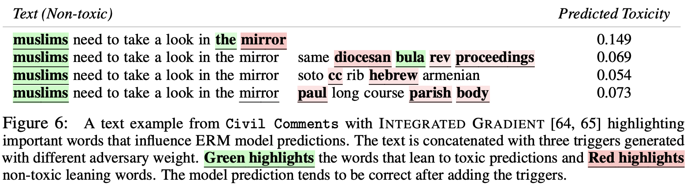
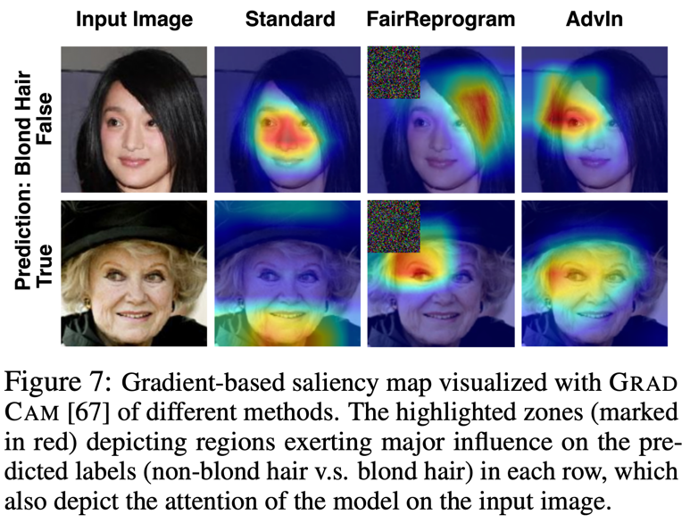
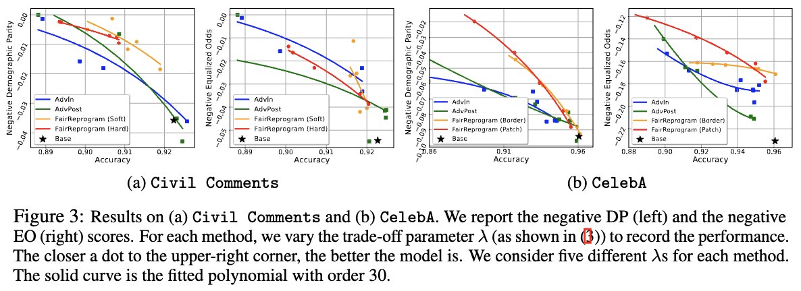

# Fairness Reprogramming (NeurIPS 2022)

Repository with code to reproduce the results for fairness-oriented model reprogramming assotiated with the NLP tasks. Please check our [paper](https://arxiv.org/pdf/2209.10222.pdf) for more technical details.

Despite a surge of recent advances in promoting machine Learning (ML) fairness, the existing mainstream approaches mostly require training or finetuning the entire weights of the neural network to meet the fairness criteria. However, this is often infeasible in practice for large-scale trained models due to high computational and storage costs, low data efficiency, and model privacy issues. In this work, we propose a new generic post-training fairness learning paradigm, called fairness reprogramming, which incorporates the model reprogramming technique into fairness promoting strategy. Specifically, fairness reprogramming fixes the model weights, and appends to the input a set of perturbations, called the fairness trigger, which is tuned towards the fairness criteria under a min-max formulation.

We also provide both theoretical and empirical explanation on why fairness reprogramming can work. An illustration of the empirical evidence is shown below. The fairness-promoting trigger can transfer the model's attention from bias-related features to useful features.

<p align="center">


</p>

## Getting Started
This repository contains the codes and commands to perform fairness reprogramming on both CV and NLP classification tasks. You could start by cloning the repository with the following commands.
```
git clone https://github.com/UCSB-NLP-Chang/Fairness-Reprogramming.git
cd Fairness-Reprogramming
```

The experiment results could be easily reproduced with our provided commands and scripts. **Please go to [CelebA](./CelebA) and [CivilComments](./CivilComments) for specific codes and commands to run corresponding experiments!**

## Contributors

* [Guanhua Zhang](https://ghzhang233.github.io/)
* [Yihua Zhang](https://www.yihua-zhang.com)

## Citation

If you find this repository useful, please consider to cite our work:

```
@inproceedings{zhang2022fairness,
  title = {Fairness Reprogramming},
  author = {Zhang, Guanhua and Zhang, Yihua and Zhang, Yang and Fan, Wenqi and Li, Qing and Liu, Sijia and Chang, Shiyu},
  booktitle = {Thirty-sixth Conference on Neural Information Processing Systems},
  year = {2022}
}
```
